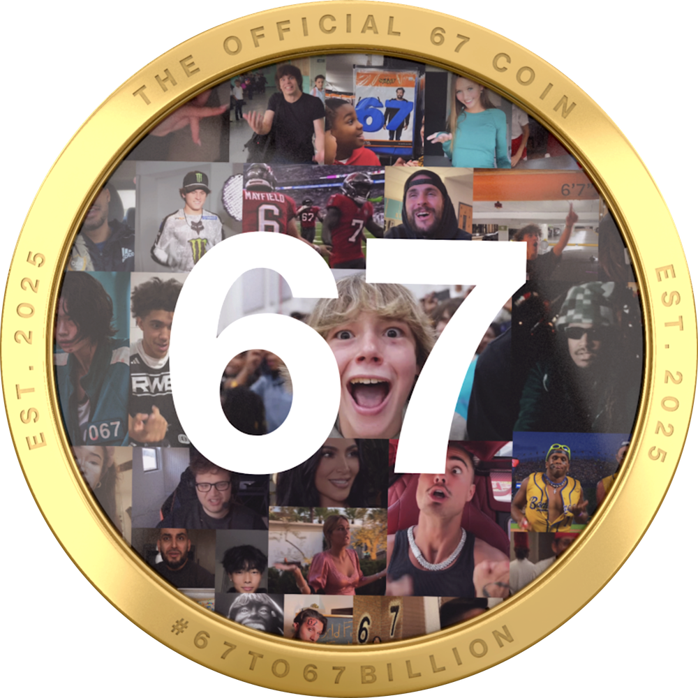

  

  <strong>67: A Meme. A Word. A Coin.</strong> 
  <strong>A Decentralized Movement Taking Over the World</strong>

---
# The Official 67 Coin ($67) – Whitepaper

## Summary
The Official 67 Coin ($67) is the tokenized form of the global 67 phenomenon — a meme, a gesture, and a signal that spread organically across countries, languages, and age groups.

The 67 hand gesture and emote is used everywhere, from schools and gaming communities to professional sports and mainstream social media. The movement has been viral for over a year and continues to grow, which is why many in the community describe 67 as having one of the strongest meme mindshares in digital culture.

### Cultural Recognition
- “67” has been widely referenced across online culture and digital communities  
- Recognized by major meme-tracking platforms  
- Referenced across global media and social platforms  
- Adopted organically by creators, gamers, and online influencers  
- Referenced across crypto exchanges and blockchain ecosystems  

$67 is a community-driven cultural participation token on Solana. It is not a coin trying to manufacture culture — the meme came first, the movement came first, and the token is how people choose to participate on-chain.

---

## Project Overview
- **Name:** The Official 67 Coin  
- **Ticker:** 67  
- **Blockchain:** Solana  
- **Token Standard:** SPL  
- **Contract Address:** `9AvytnUKsLxPxFHFqS6VLxaxt5p6BhYNr53SD2Chpump`

---

## Vision
67 is a celebration and a decentralized movement built on connection. It represents energy, laughter, and the courage to belong again.

The movement is open to everyone — especially creators and builders who want to remix, create, and share culture on-chain.

---

## What Makes 67 Different
- **Culture First:** A meme that became a coin, not a coin trying to manufacture culture  
- **Simple Viral Engine:** The 67 hand gesture and emote makes the meme easy to copy and spread  
- **Worldwide Participation:** Present across multiple demographics and communities globally  
- **Resilience:** The holder base continued to grow through market retracements  

---

## Token Utility and Use Cases
$67 is designed for cultural participation and community engagement.

- **Cultural Participation:** Holders participate in a decentralized global meme movement  
- **Community Membership:** Participation in community channels and grassroots initiatives  
- **Trading & Liquidity:** Actively traded across centralized exchanges and Solana DEXs  
- **Creative Expression:** Community-driven content, merchandise, and cultural remixing  

---

## Supply and Tokenomics
- **Total Supply:** 999,68M  
- **Max Supply:** 999,68M  
- **Inflation:** None  
- **Minting:** No additional minting planned or intended  
- **Burn Mechanism:** None  
- **Presale / Private Sale:** None  
- **Team or Foundation Allocation:** None  

$67 launched via Pump.fun on September 7, 2025 through a public, permissionless fair launch mechanism. Distribution is market-driven and community-owned.

---

## Governance and Control
$67 is community-driven and decentralized.  
There is no central authority that controls the token or the Solana network.

The token is a standard SPL asset on Solana and is fully verifiable on-chain.

---

## Technology and Security
$67 uses the standard Solana SPL token program and common Solana wallet infrastructure.

Token supply, transfers, and activity are publicly verifiable on Solana explorers.

---

## Community and Ecosystem
The 67 movement invites creators and builders to participate.

Brand assets such as stickers, stencils, and graphics are available on the official website for remixing and community use.

---

## Risk Disclosures
- $67 is a memecoin and may be highly volatile  
- $67 does not represent equity, ownership rights, or claims on revenue  
- No guarantees of profit, returns, or future development are made  
- Users should conduct their own research and comply with local laws  

---

## Official Links

